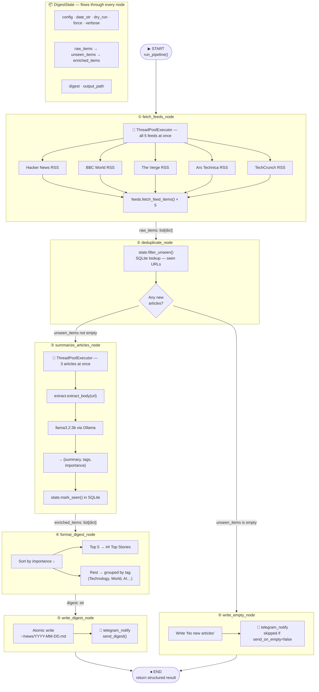

# News Buddy — LangGraph Execution Diagram

## Full Graph Flow



---

## State at Each Stage

```
START
  config, date_str, dry_run, force, verbose
  raw_items=[]  unseen_items=[]  enriched_items=[]  digest=""  output_path=""

  ▼ fetch_feeds_node
  raw_items=[
    {source, title, url, published_at, rss_summary},  ← up to 50 items
    ...
  ]

  ▼ deduplicate_node
  unseen_items=[
    {source, title, url, published_at, rss_summary},  ← only new ones
    ...
  ]

  ▼ summarize_articles_node
  enriched_items=[
    {source, title, url, published_at, rss_summary,
     summary, tags, importance},                       ← Ollama adds these
    ...
  ]

  ▼ format_digest_node
  digest="# News Digest — 2026-05-26\n## Top Stories\n..."

  ▼ write_digest_node
  output_path="/Users/harshagarwal/news/2026-05-26.md"

END → {digest, output_path, item_count, error}
```

---

## Parallelism Detail

```
fetch_feeds_node
┌─────────────────────────────────────────────────────┐
│  ThreadPoolExecutor(max_workers=5)                  │
│                                                     │
│  Thread 1 ──► Hacker News  ──► 10 items  ──┐       │
│  Thread 2 ──► BBC World    ──► 10 items  ──┤       │
│  Thread 3 ──► The Verge    ──►  6 items  ──┼──► [] │
│  Thread 4 ──► Ars Technica ──►  3 items  ──┤       │
│  Thread 5 ──► TechCrunch   ──►  5 items  ──┘       │
│                                                     │
│  Sequential: ~15s    Parallel: ~4s  (~4x faster)   │
└─────────────────────────────────────────────────────┘

summarize_articles_node
┌─────────────────────────────────────────────────────┐
│  ThreadPoolExecutor(max_workers=3)                  │
│                                                     │
│  Thread 1 ──► Article 1 ──► Ollama ──► summary     │
│  Thread 2 ──► Article 2 ──► Ollama ──► summary     │
│  Thread 3 ──► Article 3 ──► Ollama ──► summary     │
│               Article 4 ──► (waits for free slot)  │
│                    ...                              │
│                                                     │
│  34 articles × ~8s each = ~90s sequential          │
│  With 3 workers              = ~30s  (3x faster)   │
└─────────────────────────────────────────────────────┘
```

---

## Checkpoint (Failure Recovery)

```
MemorySaver checkpoints state after each node completes.

If Ollama crashes mid-summarization:

  fetch_feeds    ✅ saved
  deduplicate    ✅ saved
  summarize      ❌ crashed at article 17/34

  → Restart pipeline with same thread_id
  → LangGraph replays from last checkpoint
  → Resumes from article 17, not article 1
```

---

## Conditional Edge

```
deduplicate_node
        │
        ▼
  should_summarize()
        │
        ├── unseen_items is NOT empty ──► summarize_articles ──► format ──► write
        │
        └── unseen_items IS empty     ──► write_empty ──► END
                                           (saves time, skips Ollama entirely)
```
