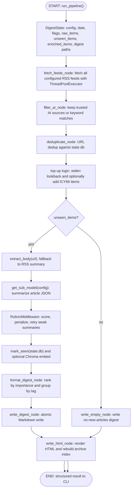
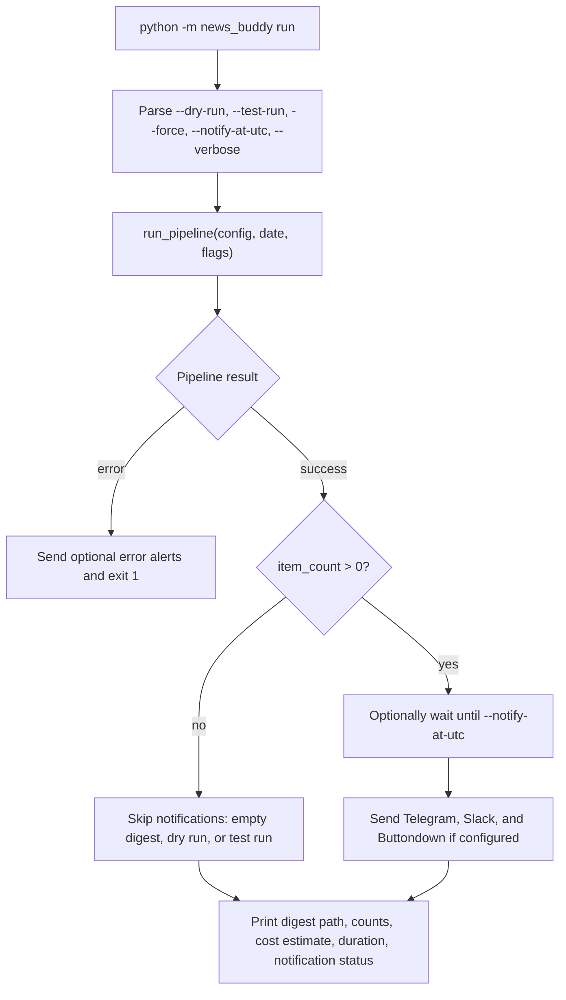
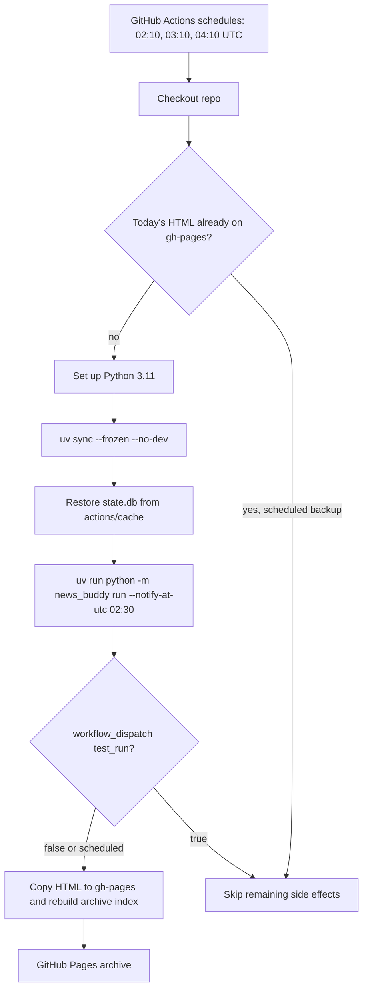
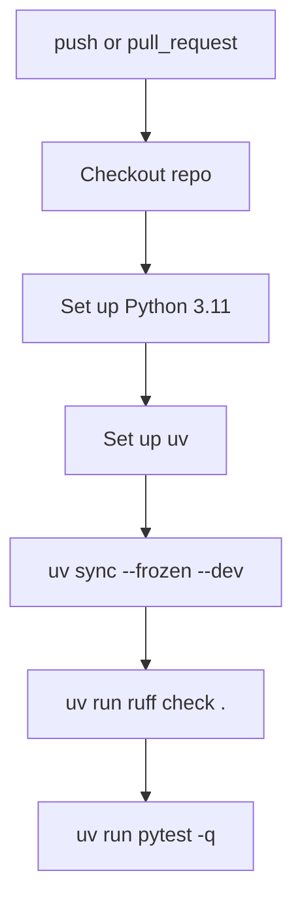

# News Buddy - LangGraph Execution Diagram

This diagram reflects the current implementation in `news_buddy/agent.py`.

## Full Graph Flow


```mermaid
flowchart TD
    START(["START: run_pipeline()"])

    STATE["DigestState: config, date, flags, raw_items, unseen_items, enriched_items, digest paths"]

    FETCH["fetch_feeds_node: fetch all configured RSS feeds with ThreadPoolExecutor"]
    FILTER["filter_ai_node: keep trusted AI sources or keyword matches"]
    DEDUP["deduplicate_node: URL dedup against state.db"]
    TOPUP["top-up logic: widen lookback and optionally add ICYMI items"]
    ROUTE{"unseen_items?"}

    EXTRACT["extract_body(url), fallback to RSS summary"]
    SUMMARIZE["get_sub_model(config): summarize article JSON"]
    RUBRIC["RubricMiddleware: score, penalize, retry weak summaries"]
    PERSIST["mark_seen(state.db) and optional Chroma embed"]
    FORMAT["format_digest_node: rank by importance and group by tag"]
    WRITE_MD["write_digest_node: atomic Markdown write"]
    WRITE_EMPTY["write_empty_node: write no-new-articles digest"]
    WRITE_HTML["write_html_node: render HTML and rebuild archive index"]
    END(["END: structured result to CLI"])

    START --> STATE --> FETCH --> FILTER --> DEDUP --> TOPUP --> ROUTE
    ROUTE -- "yes" --> EXTRACT --> SUMMARIZE --> RUBRIC --> PERSIST --> FORMAT --> WRITE_MD --> WRITE_HTML --> END
    ROUTE -- "no" --> WRITE_EMPTY --> WRITE_HTML --> END
```

## CLI and Notification Flow


```mermaid
flowchart TD
    CLI["python -m news_buddy run"]
    FLAGS["Parse --dry-run, --test-run, --force, --notify-at-utc, --verbose"]
    PIPELINE["run_pipeline(config, date, flags)"]
    RESULT{"Pipeline result"}
    ERROR["Send optional error alerts and exit 1"]
    ARTICLES{"item_count > 0?"}
    QUIET["Skip notifications: empty digest, dry run, or test run"]
    WAIT["Optionally wait until --notify-at-utc"]
    SEND["Send Telegram, Slack, and Buttondown if configured"]
    PRINT["Print digest path, counts, cost estimate, duration, notification status"]

    CLI --> FLAGS --> PIPELINE --> RESULT
    RESULT -- "error" --> ERROR
    RESULT -- "success" --> ARTICLES
    ARTICLES -- "no" --> QUIET --> PRINT
    ARTICLES -- "yes" --> WAIT --> SEND --> PRINT
```

## Scheduled Run


```mermaid
flowchart TD
    CRON["GitHub Actions schedules: 02:10, 03:10, 04:10 UTC"]
    CHECKOUT["Checkout repo"]
    GUARD{"Today's HTML already on gh-pages?"}
    PY["Set up Python 3.11"]
    INSTALL["uv sync --frozen --no-dev"]
    CACHE["Restore state.db from actions/cache"]
    RUN["uv run python -m news_buddy run --notify-at-utc 02:30"]
    TEST{"workflow_dispatch test_run?"}
    DEPLOY["Copy HTML to gh-pages and rebuild archive index"]
    SKIP["Skip remaining side effects"]
    PAGES["GitHub Pages archive"]

    CRON --> CHECKOUT --> GUARD
    GUARD -- "yes, scheduled backup" --> SKIP
    GUARD -- "no" --> PY --> INSTALL --> CACHE --> RUN --> TEST
    TEST -- "false or scheduled" --> DEPLOY --> PAGES
    TEST -- "true" --> SKIP
```

## State at Each Stage

```text
START
  config, date_str, dry_run, force, test_run, verbose
  raw_items=[], unseen_items=[], enriched_items=[], digest="", output_path="", html_path=""

fetch_feeds_node
  raw_items=[
    {source, title, url, published_at, rss_summary},
    ...
  ]

filter_ai_node
  raw_items=[only trusted AI sources or keyword matches]

deduplicate_node
  unseen_items=[items not present in state.db]
  may widen lookback and may add ICYMI seen items if configured
  max_articles caps the number of summaries

summarize_articles_node
  enriched_items=[
    {source, title, url, published_at, rss_summary, summary, tags, importance, rubric?},
    ...
  ]
  total_tokens and rubric_failures are recorded

format_digest_node
  digest="# News Digest - YYYY-MM-DD ..."

write_digest_node / write_empty_node
  output_path="~/news/YYYY-MM-DD.md"

write_html_node
  html_path="~/news/YYYY-MM-DD.html"
  archive index regenerated

END
  {digest, output_path, html_path, item_count, total_tokens, rubric_failures, error}
```

## Important Flags

- `--dry-run`: no network or file side effects.
- `--test-run`: live fetch and summarize, but do not mark seen, embed RAG, deploy, or notify.
- `--force`: skip deduplication.
- `--notify-at-utc HH:MM`: delay successful non-empty notifications until that UTC time.
- `--verbose`: print graph progress to stderr.

## CI Workflow


```mermaid
flowchart TD
    PUSH["push or pull_request"]
    CHECKOUT["Checkout repo"]
    PY["Set up Python 3.11"]
    UV["Set up uv"]
    SYNC["uv sync --frozen --dev"]
    RUFF["uv run ruff check ."]
    PYTEST["uv run pytest -q"]

    PUSH --> CHECKOUT --> PY --> UV --> SYNC --> RUFF --> PYTEST
```
