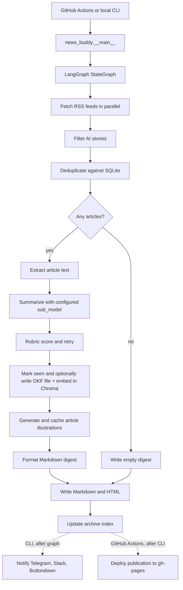

# News Buddy

[](https://github.com/Harshagarwal06/buddy_agent/actions/workflows/daily-digest.yml)
[](https://github.com/Harshagarwal06/buddy_agent/actions/workflows/ci.yml)

News Buddy is a daily AI news digest that fetches RSS feeds, filters for AI-relevant stories, deduplicates against prior runs, summarizes the best articles with an LLM, generates a visual explainer for each story, publishes a web archive, and can send the result by email, Telegram, or Slack.

Live archive: https://harshagarwal06.github.io/buddy_agent/

The project started as a fully agentic `deepagents` experiment. After testing the daily workflow, the orchestration was moved to a deterministic LangGraph pipeline: fetch, filter, dedup, summarize, write, notify. That kept the system cheaper and easier to debug while preserving LLM judgment where it matters: article summarization, editorial importance, and article-specific image planning.

## What It Does

- Reads AI-focused RSS feeds from `config.yaml`.
- Filters stories with source allowlists and AI keywords.
- Deduplicates URLs with a local SQLite `state.db`.
- Backfills the lookback window when too few fresh stories survive filtering.
- Writes self-contained reader briefings through a provider-swappable LLM layer.
- Requires each briefing to explain what happened, useful context, and why it matters, scored by a pure-heuristic rubric (`news_buddy/rubric.py`); thin summaries are retried once.
- Generates cached 4:3 article-grounded explainers in one shared editorial system.
- Writes Markdown and HTML digests to `~/news/YYYY-MM-DD.md` and `.html`.
- Regenerates an archive index for GitHub Pages.
- Sends non-empty digests through Telegram, Slack, and Buttondown when configured.
- Supports safe manual verification with `--test-run`, which fetches and summarizes without mutating dedup state, writing RAG entries, deploying, or notifying subscribers.
- Writes each embedded article once as an OKF (Open Knowledge Format) Markdown file (`news_buddy/knowledge_base.py`), then embeds that text into a local Chroma vector store for semantic search.
- Exposes a separate read-only MCP server (`news_buddy_mcp/`) that lets an LLM search and fetch past digests over the public JSON archive.
- Ships an offline evaluation harness (`scripts/eval_sub_model.py`) that scores candidate summarizer models against frozen article fixtures with the same rubric, so model swaps are decided on evidence.
- Supports optional OpenTelemetry tracing to a local Arize Phoenix UI for full LLM-call visibility during development.

## Architecture



See [DIAGRAM.md](DIAGRAM.md) for the node-level flow,
[docs/rag-architecture.html](docs/rag-architecture.html) for the RAG/search
view, and the [Code Brain](openwiki/index.md) for the source-linked maintainer
documentation.

## Code Brain

The [`openwiki/`](openwiki/) directory is a reviewed OpenWiki knowledge layer
covering runtime flow, providers, image generation, persistence, publishing,
notifications, safe run modes, and known gaps. Start with
[`openwiki/quickstart.md`](openwiki/quickstart.md).

It is documentation only: News Buddy never imports or reads it at runtime.
Source code, tests, `config.yaml`, and active workflows remain authoritative.
[`openwiki/INSTRUCTIONS.md`](openwiki/INSTRUCTIONS.md) constrains generation so
the wiki preserves important boundaries such as deterministic filtering versus
LLM summarization and local Chroma versus public JSON/MCP search.

OpenWiki 0.2.4 is pinned in
[`.github/workflows/openwiki-update.yml`](.github/workflows/openwiki-update.yml).
The workflow runs manually or weekly, uses the existing `NVIDIA_API_KEY`
repository secret, validates the result, and opens a documentation-only draft
pull request. It never runs the digest or deploys `gh-pages`.

To regenerate and validate locally with `NVIDIA_API_KEY` already exported:

```bash
npm install --global openwiki@0.2.4 mermaid@11.16.0 jsdom@29.1.1
OPENWIKI_PROVIDER=nvidia \
OPENWIKI_MODEL_ID=nvidia/nemotron-3-super-120b-a12b \
OPENWIKI_TELEMETRY_DISABLED=1 \
openwiki code --update --print
python scripts/validate_openwiki.py
```

## Repository Tour

- `PROJECT_OVERVIEW.md` - the complete source-derived reference: technology inventory, subsystem deep dives, full configuration and environment reference, run-mode semantics, and project statistics.
- `news_buddy/agent.py` - the LangGraph pipeline and node logic.
- `news_buddy/__main__.py` - CLI, notification routing, and run summary output.
- `news_buddy/llm.py` - the only place that constructs LLM clients.
- `news_buddy/feeds.py` - RSS fetching and item normalization.
- `news_buddy/extract.py` - article body extraction with RSS-summary fallback.
- `news_buddy/image_generator.py` - NVIDIA/Hugging Face image generation, validation, WebP caching, and SVG fallback assets.
- `prompts/image_style.md` - the single layout, style, grounding, and image-quality contract.
- `news_buddy/state.py` - SQLite dedup state.
- `news_buddy/rubric.py` - pure-heuristic summary quality scoring and the strict-retry decision.
- `news_buddy/html_writer.py` and `news_buddy/archive_writer.py` - generated digest pages and archive index.
- `news_buddy/knowledge_base.py` - writes each accepted article as an OKF-formatted Markdown file, the source of truth for embedding.
- `news_buddy/rag.py` - ChromaDB-backed semantic search over saved articles; embeds the OKF file text.
- `news_buddy/backfill_rag.py` - one-time backfill of the vector store from articles seen before RAG existed.
- `news_buddy/observability.py` - opt-in OpenTelemetry tracing via Arize Phoenix.
- `news_buddy/buttondown_notify.py`, `telegram_notify.py`, `slack_notify.py` - notification adapters.
- `news_buddy_mcp/` - separate FastMCP server exposing read-only search/digest tools over the public JSON archive, with its own tests, lint, and Dockerfile.
- `scripts/eval_sub_model.py` and `scripts/eval_report.py`/`eval_scoring.py`/`eval_store.py` - offline harness for comparing candidate summarizer models against frozen fixtures.
- `.agents/skills/topicsearch/` - local agent skill for combined keyword and semantic archive search.
- `.github/workflows/daily-digest.yml` - scheduled cloud run and GitHub Pages deploy.
- `.github/workflows/openwiki-update.yml` - pinned manual/weekly Code Brain update that proposes a draft PR.
- `openwiki/` - source-linked maintainer documentation generated with OpenWiki and reviewed against the code.
- `scripts/validate_openwiki.py` - dependency-free Code Brain structure, link, and accuracy tripwire.
- `tests/` - 124 tests covering notifications, package resource paths, archive signup behavior, CLI notification suppression, rubric scoring, RAG, and the evaluation harness.

## Setup

Requirements:

- Python 3.11+
- `uv` or `pip`
- One LLM provider credential:
  - `NVIDIA_API_KEY` for the default NVIDIA NIM summarizer/planner
  - `GOOGLE_API_KEY` when Gemini is selected and for RAG embeddings
  - `HF_TOKEN` when Hugging Face is selected instead
  - local Ollama plus pulled models if `llm.provider: ollama`

Install:

```bash
git clone https://github.com/Harshagarwal06/buddy_agent.git
cd buddy_agent
python -m venv .venv
source .venv/bin/activate
pip install .
cp .env.example .env
```

Edit `.env` with provider and notification secrets. Edit `config.yaml` to tune feeds, keyword filtering, article limits, and model provider.

The default install contains everything needed for the configured NVIDIA
pipeline. Install only the extras you use for other providers or local tools:

```bash
pip install '.[google]'          # Gemini provider
pip install '.[huggingface]'     # Hugging Face provider
pip install '.[ollama]'          # local Ollama provider
pip install '.[rag]'             # local Chroma semantic search + Gemini embeddings
pip install '.[observability]'   # OpenTelemetry client for a Phoenix collector
```

Packaged defaults include `config.yaml`, prompts, and web assets, so the
`news-buddy` command also works when installed outside a source checkout. By
default, writable state is kept in the repository root for a checkout and the
current directory for an installed package. Set `NEWS_BUDDY_HOME` to choose an
explicit writable data directory.

The `images` block in `config.yaml` controls the image model, output dimensions,
compression, concurrency, retries, and shared explainer system. Its
`style_guide` points to `prompts/image_style.md`, which both the article planner
and image renderer read. Production also sets `require_article_brief: true`, so
an LLM outage or incomplete plan stops publication instead of producing generic
placeholder diagrams. The default NVIDIA FLUX.2-klein-4B integration uses
`NVIDIA_API_KEY`. Normal `--test-run` executions skip image generation unless
`images.generate_in_test_run` is explicitly set to `true`.

Tracing is opt-in and off by default. Install the `observability` extra, run an
[Arize Phoenix](https://phoenix.arize.com/) collector separately, and set
`OTEL_TRACING=true` before a run to trace every LLM call
(`PHOENIX_COLLECTOR_ENDPOINT`, default `http://localhost:6006`); see
`news_buddy/observability.py`.

## Running Locally

Dry run with no network or file side effects:

```bash
python -m news_buddy run --dry-run --verbose
```

Safe live validation, recommended before changing scheduled delivery:

```bash
python -m news_buddy run --test-run --verbose
```

Real local run:

```bash
python -m news_buddy run --verbose
```

By default, output is written to `~/news/`. The CLI prints article count, estimated token cost, duration, rubric failures, and notification status.

## Deployment

The scheduled workflow in `.github/workflows/daily-digest.yml` runs daily in GitHub Actions. It:

1. Sets up Python and uv.
2. Checks `gh-pages` for today's digest and skips backup runs when it is already published.
3. Installs from `uv.lock` with `uv sync --frozen --no-dev`.
4. Restores `state.db` and generated images from Actions cache.
5. Runs `uv run python -m news_buddy run --notify-at-utc 02:30`.
6. Copies the generated HTML, JSON search record, and image assets to the `gh-pages` branch.
7. Rebuilds the archive index for GitHub Pages.

The workflow has one primary morning schedule and two backup schedules. A concurrency group prevents overlapping digest jobs, and the `gh-pages` preflight keeps delayed backup schedules from sending duplicate notifications after the day's digest is already published.

A separate CI workflow (`.github/workflows/ci.yml`) runs on pushes and pull requests with two jobs: lint, 124 tests, a runtime dependency audit, and an installed-wheel smoke test for the main package; plus lint, 15 tests, a runtime dependency audit, and a Docker build for `news_buddy_mcp/`.

Manual `workflow_dispatch` defaults to `test_run: true`, so a verification run does not mark stories seen, deploy pages, or notify subscribers.

Required GitHub secrets depend on enabled features:

- `NVIDIA_API_KEY` for the default NVIDIA summarizer/image planner, FLUX.2 article images, and the OpenWiki update workflow.
- `GOOGLE_API_KEY` when Gemini summarization is selected and for local RAG embeddings.
- `HF_TOKEN` when Hugging Face summarization is selected.
- `TELEGRAM_BOT_TOKEN` and `TELEGRAM_CHAT_ID` for Telegram.
- `SLACK_WEBHOOK_URL` for Slack.
- `BUTTONDOWN_API_KEY` for sending email.
- `BUTTONDOWN_USERNAME` for the archive signup form.

## Search

Keyword search over the SQLite seen-state:

```bash
python news_buddy/search.py "OpenAI" --limit 10
```

Semantic search over the Chroma vector store:

```bash
python news_buddy/semantic_search_cli.py "AI chip capacity" --limit 10
```

The daily workflow currently sets `NEWS_BUDDY_RAG_ENABLED=false`, so Chroma is best treated as a local/search experiment unless the workflow persistence is enabled.

The RAG extra uses Chroma's in-process `PersistentClient`. Do not expose a
Chroma HTTP server from this environment: ChromaDB 1.5.9 has an
[unfixed pre-authentication server vulnerability](https://osv.dev/vulnerability/PYSEC-2026-311)
in an API path that News Buddy does not use.

## Public MCP Server

`news_buddy_mcp/` is a separate FastMCP server that reads the public
`index.json`/`YYYY-MM-DD.json` archive published to `gh-pages` and exposes it
as three read-only MCP tools: `search_articles`, `get_digest`, and
`list_digests`. It never touches `state.db` or Chroma, has its own
`pyproject.toml`/`uv.lock`, test suite, and Dockerfile, and is built and
tested by a dedicated job in CI.

```bash
cd news_buddy_mcp
uv sync
NEWS_BUDDY_ARCHIVE_URL=https://harshagarwal06.github.io/buddy_agent uv run python -m news_buddy_mcp.server
```

## Model Evaluation

`scripts/eval_sub_model.py` captures a frozen set of real articles as
fixtures, then replays them through candidate `sub_model` values and scores
each with the pipeline's own `RubricMiddleware` and image-brief validation —
so a model swap is judged by brief validity, rubric pass rate, latency, and
token cost, not vibes. It is opt-in (never run by CI, since it makes real
model calls):

```bash
python -m scripts.eval_sub_model --capture   # freeze fixtures once
python -m scripts.eval_sub_model --run        # score candidates against them
```

[`docs/evals/2026-07-30-sub-model-baseline.md`](docs/evals/2026-07-30-sub-model-baseline.md)
is a worked example: four candidates were compared against the production
default (`meta/llama-3.1-8b-instruct`), and the incumbent was kept because
every candidate fell short on brief validity, the pass/fail gate fixed before
the run.

## Image Directive Evaluation

`scripts/eval_image.py` measures whether changing the image style directive
reduces contract violations. It renders a 2×2 of `{negated, positive}` phrasing
× `{truncated, contract-preserved}` assembly over a 16-article corpus stratified
into mechanism and person topics, then scores the **raw** provider output with a
deterministic background check plus a calibrated vision judge.

Like the model eval it is opt-in and never run by CI, since it makes real image
and vision API calls:

```bash
python -m scripts.eval_image --brief    # once: cache one brief per article
python -m scripts.eval_image --run      # 64 renders, judged
python -m scripts.eval_image --label    # fill in the template by hand
python -m scripts.eval_image --report   # aggregate -> docs/evals/
```

The judge's agreement with your hand labels is printed in the report header;
below 90% the report marks its own conclusions provisional.

## Current Gaps

- Dedup is URL-based, so the same story from several outlets can still appear as separate entries.
- RAG is not persisted in CI yet (`NEWS_BUDDY_RAG_ENABLED=false` in the daily workflow).
- Image generation, caching, rendering, notifications, rubric scoring, RAG/knowledge-base writing, and the evaluation harness have focused tests; raw feed parsing (`news_buddy/feeds.py`) and the SQLite dedup mechanics (`news_buddy/state.py`) still need direct coverage.

These are intentionally visible because they make the next engineering steps clear: story-level clustering, live RAG persistence, state recovery, and broader tests.
