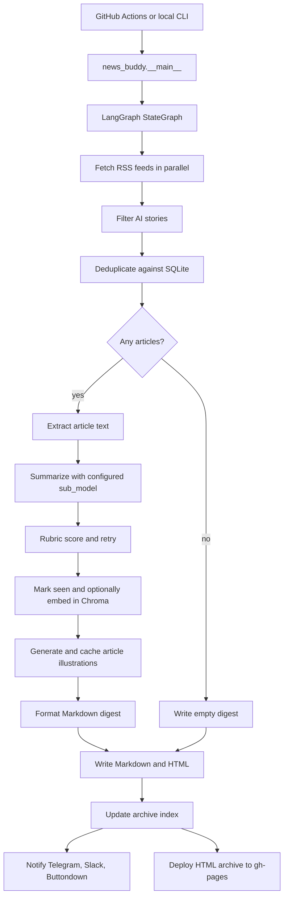

# News Buddy

[](https://github.com/Harshagarwal06/buddy_agent/actions/workflows/daily-digest.yml)
[](https://github.com/Harshagarwal06/buddy_agent/actions/workflows/ci.yml)

News Buddy is a daily AI news digest that fetches RSS feeds, filters for AI-relevant stories, deduplicates against prior runs, summarizes the best articles with an LLM, generates a visual explainer for each story, publishes a web archive, and can send the result by email, Telegram, or Slack.

Live archive: https://harshagarwal06.github.io/buddy_agent/

The project started as a fully agentic `deepagents` experiment. After testing the daily workflow, the orchestration was moved to a deterministic LangGraph pipeline: fetch, filter, dedup, summarize, write, notify. That kept the system cheaper and easier to debug while preserving LLM judgment where it matters: article summarization and importance scoring.

## What It Does

- Reads AI-focused RSS feeds from `config.yaml`.
- Filters stories with source allowlists and AI keywords.
- Deduplicates URLs with a local SQLite `state.db`.
- Backfills the lookback window when too few fresh stories survive filtering.
- Writes self-contained reader briefings through a provider-swappable LLM layer.
- Requires each briefing to explain what happened, useful context, and why it matters; thin summaries are retried once.
- Generates cached 4:3 article-grounded explainers in one shared editorial system.
- Writes Markdown and HTML digests to `~/news/YYYY-MM-DD.md` and `.html`.
- Regenerates an archive index for GitHub Pages.
- Sends non-empty digests through Telegram, Slack, and Buttondown when configured.
- Supports safe manual verification with `--test-run`, which fetches and summarizes without mutating dedup state, writing RAG entries, deploying, or notifying subscribers.
- Includes Chroma-backed semantic search for local archive exploration.

## Architecture



See [DIAGRAM.md](DIAGRAM.md) for the node-level flow and [docs/rag-architecture.html](docs/rag-architecture.html) for the RAG/search view.

## Repository Tour

- `news_buddy/agent.py` - the LangGraph pipeline and node logic.
- `news_buddy/__main__.py` - CLI, notification routing, and run summary output.
- `news_buddy/llm.py` - the only place that constructs LLM clients.
- `news_buddy/feeds.py` - RSS fetching and item normalization.
- `news_buddy/extract.py` - article body extraction with RSS-summary fallback.
- `news_buddy/image_generator.py` - NVIDIA/Hugging Face image generation, validation, WebP caching, and SVG fallback assets.
- `prompts/image_style.md` - the single layout, style, grounding, and image-quality contract.
- `news_buddy/state.py` - SQLite dedup state.
- `news_buddy/html_writer.py` and `news_buddy/archive_writer.py` - generated digest pages and archive index.
- `news_buddy/rag.py` - ChromaDB-backed semantic search over saved articles.
- `news_buddy/buttondown_notify.py`, `telegram_notify.py`, `slack_notify.py` - notification adapters.
- `.agents/skills/topicsearch/` - local agent skill for combined keyword and semantic archive search.
- `.github/workflows/daily-digest.yml` - scheduled cloud run and GitHub Pages deploy.
- `tests/` - focused coverage for notifications, archive signup behavior, and CLI notification suppression.

## Setup

Requirements:

- Python 3.11+
- `uv` or `pip`
- One LLM provider credential:
  - `GOOGLE_API_KEY` for the default Gemini summarizer/planner and RAG embeddings
  - `HF_TOKEN` when Hugging Face is selected instead
  - local Ollama plus pulled models if `llm.provider: ollama`

Install:

```bash
git clone https://github.com/Harshagarwal06/buddy_agent.git
cd buddy_agent
python -m venv .venv
source .venv/bin/activate
pip install .
cp .env.example .env
```

Edit `.env` with provider and notification secrets. Edit `config.yaml` to tune feeds, keyword filtering, article limits, and model provider.

The `images` block in `config.yaml` controls the image model, output dimensions,
compression, concurrency, retries, and shared explainer system. Its
`style_guide` points to `prompts/image_style.md`, which both the article planner
and image renderer read. Production also sets `require_article_brief: true`, so
an LLM outage or incomplete plan stops publication instead of producing generic
placeholder diagrams. The default NVIDIA FLUX.2-klein-4B integration uses
`NVIDIA_API_KEY`. Normal `--test-run` executions skip image generation unless
`images.generate_in_test_run` is explicitly set to `true`.

## Running Locally

Dry run with no network or file side effects:

```bash
python -m news_buddy run --dry-run --verbose
```

Safe live validation, recommended before changing scheduled delivery:

```bash
python -m news_buddy run --test-run --verbose
```

Real local run:

```bash
python -m news_buddy run --verbose
```

By default, output is written to `~/news/`. The CLI prints article count, estimated token cost, duration, rubric failures, and notification status.

## Deployment

The scheduled workflow in `.github/workflows/daily-digest.yml` runs daily in GitHub Actions. It:

1. Sets up Python and uv.
2. Checks `gh-pages` for today's digest and skips backup runs when it is already published.
3. Installs from `uv.lock` with `uv sync --frozen --no-dev`.
4. Restores `state.db` and generated images from Actions cache.
5. Runs `uv run python -m news_buddy run --notify-at-utc 02:30`.
6. Copies the generated HTML, JSON search record, and image assets to the `gh-pages` branch.
7. Rebuilds the archive index for GitHub Pages.

The workflow has one primary morning schedule and two backup schedules. A concurrency group prevents overlapping digest jobs, and the `gh-pages` preflight keeps delayed backup schedules from sending duplicate notifications after the day's digest is already published.

A separate CI workflow runs `ruff check .` and `pytest` on pushes and pull requests.

Manual `workflow_dispatch` defaults to `test_run: true`, so a verification run does not mark stories seen, deploy pages, or notify subscribers.

Required GitHub secrets depend on enabled features:

- `GOOGLE_API_KEY` for the default Gemini summarizer and image planner.
- `HF_TOKEN` when Hugging Face summarization is selected.
- `NVIDIA_API_KEY` for FLUX.2 article images.
- `TELEGRAM_BOT_TOKEN` and `TELEGRAM_CHAT_ID` for Telegram.
- `SLACK_WEBHOOK_URL` for Slack.
- `BUTTONDOWN_API_KEY` for sending email.
- `BUTTONDOWN_USERNAME` for the archive signup form.

## Search

Keyword search over the SQLite seen-state:

```bash
python news_buddy/search.py "OpenAI" --limit 10
```

Semantic search over the Chroma vector store:

```bash
python news_buddy/semantic_search_cli.py "AI chip capacity" --limit 10
```

The daily workflow currently sets `NEWS_BUDDY_RAG_ENABLED=false`, so Chroma is best treated as a local/search experiment unless the workflow persistence is enabled.

## Current Gaps

- Dedup is URL-based, so the same story from several outlets can still appear as separate entries.
- RAG is not persisted in CI yet.
- Image generation, caching, rendering, notifications, and archive paths have focused tests; feed parsing, dedup, and rubric scoring still need broader coverage.

These are intentionally visible because they make the next engineering steps clear: story-level clustering, live RAG persistence, state recovery, and broader tests.
