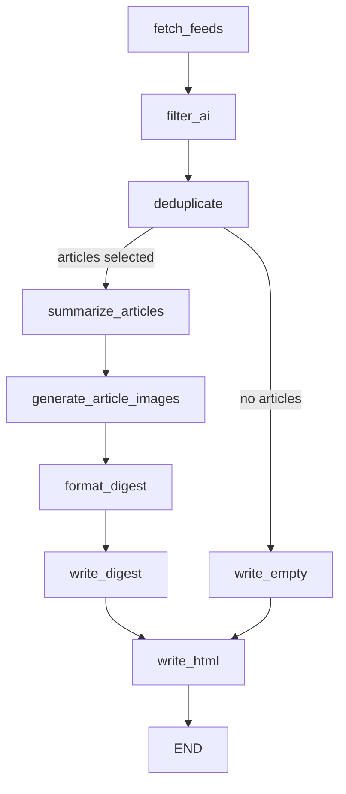

# LangGraph Pipeline & CLI Execution

The active graph is assembled by `build_graph()` in
[`news_buddy/agent.py`](../../news_buddy/agent.py). It uses `DigestState`, a
typed state object carrying configuration, run flags, article collections,
rendered content, output paths, and metrics.

## Exact graph

`should_summarize()` supplies the only conditional edge. Notifications and
GitHub Pages deployment are not graph nodes.

## Node responsibilities

- `fetch_feeds_node`: skips network in dry-run mode; otherwise fetches every
  configured source through a `ThreadPoolExecutor`.
- `filter_ai_node`: applies trusted-source and keyword rules without an LLM.
- `deduplicate_node`: skips SQLite dedup for `--force`, `--test-run`, and
  `--dry-run`; otherwise filters against `state.db`, tops up, then enforces
  `max_articles`.
- `summarize_articles_node`: extracts and summarizes selected articles in a
  five-worker thread pool, scores summaries, performs at most one configured
  strict retry, and handles seen-state/RAG writes.
- `generate_article_images_node`: skips disabled, dry-run, and normal test-run
  image work; otherwise loads or creates per-article images.
- `format_digest_node`: sorts by importance, creates top stories, then groups
  the remainder by the first tag.
- `write_digest_node` / `write_empty_node`: atomically write the Markdown file
  outside dry-run mode.
- `write_html_node`: writes the HTML page, optional per-day JSON record,
  `index.json` manifest, and archive index.

The graph is compiled with an in-memory `MemorySaver` checkpointer by default.
It does not persist LangGraph checkpoints between processes.

## CLI boundary

[`news_buddy/__main__.py`](../../news_buddy/__main__.py) loads `.env`, starts
optional tracing, parses the `run` command, and calls `run_pipeline()`. After
the graph returns it:

1. Optionally waits until `--notify-at-utc`.
2. Sends Telegram or Slack success/error messages when configured.
3. Sends Buttondown only for a successful non-empty digest.
4. Prints paths, counts, token estimates, duration, rubric results, image
   results, notification status, and a preview.

Dry and test runs suppress all three notification channels. A test run still
writes Markdown, HTML, JSON, and archive files to the configured output
directory; its safety boundary concerns dedup state, RAG writes, image
generation by default, deployment, and notifications—not output files.

## Deployment boundary

The scheduled workflow in
[`daily-digest.yml`](../../.github/workflows/daily-digest.yml) invokes the CLI,
then separately stages publication files into a checkout of the `gh-pages`
branch. Manual test runs skip that deploy step. Scheduled backup runs first
look for today's HTML file on `gh-pages` to prevent duplicate publication and
notification sends.

## Related pages

- [Feeds and article selection](../processing/feed-and-article.md)
- [LLM and model providers](../llm-and-models.md)
- [Notifications and operations](../notifications-and-operations.md)
